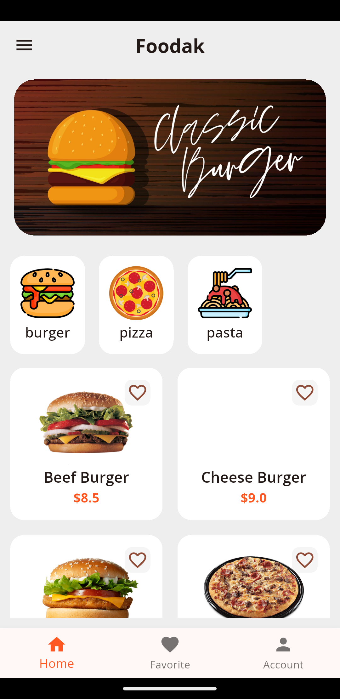
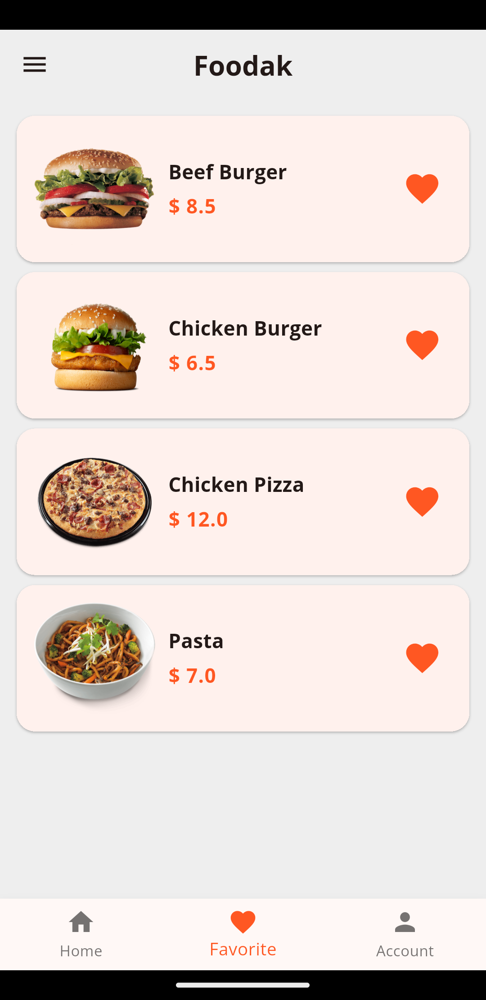
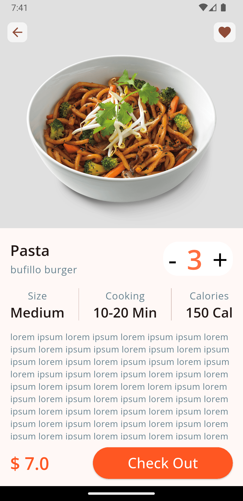
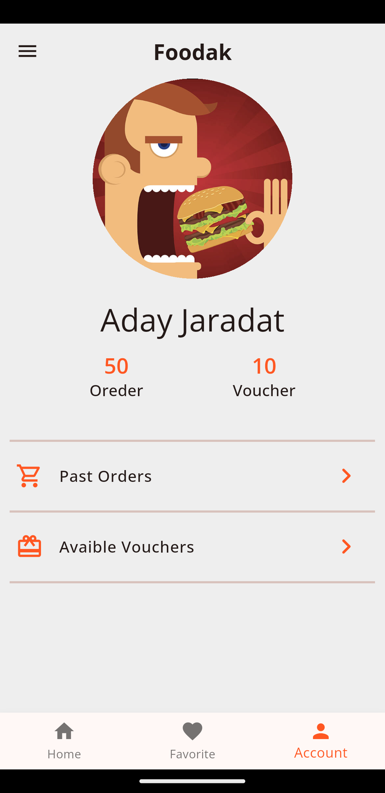

# Food Delivery App UI 🍔🚀

A modern, clean, and responsive Food Delivery Application UI built with **Flutter**. This project focuses on a smooth user experience for browsing food categories, viewing details, and managing favorite items.

## ✨ Features

- **Home Screen:** Beautifully designed categories and a "Popular" items list.
- **Food Details:** Detailed view for each item including price, rating, and description.
- **Favorites System:** Save and manage your favorite meals for quick access.
- **Responsive Design:** Optimized for various screen sizes using Flutter's layout system.

## 📸 Screenshots

| Home | Favoraite | Food Details | Profile |
| :---: | :---: | :---: | :---: |
|  |  |  |  |

## 🛠️ Tech Stack & Dependencies

- **Framework:** [Flutter](https://flutter.dev/)
- **Language:** [Dart](https://dart.dev/)
- **Fonts:** [Google Fonts](https://pub.dev/packages/google_fonts)
- **Icons:** Material Icons & Cupertino Icons

## 🚀 Getting Started

### Prerequisites
Ensure you have the Flutter SDK installed on your machine.
- [Flutter Installation Guide](https://docs.flutter.dev/get-started/install)

### Installation

1. **Clone the repository:**
   ```bash
   git clone [https://github.com/OdayJaradat/food_delivery_UI.git](https://github.com/OdayJaradat/food_delivery_UI.git)
